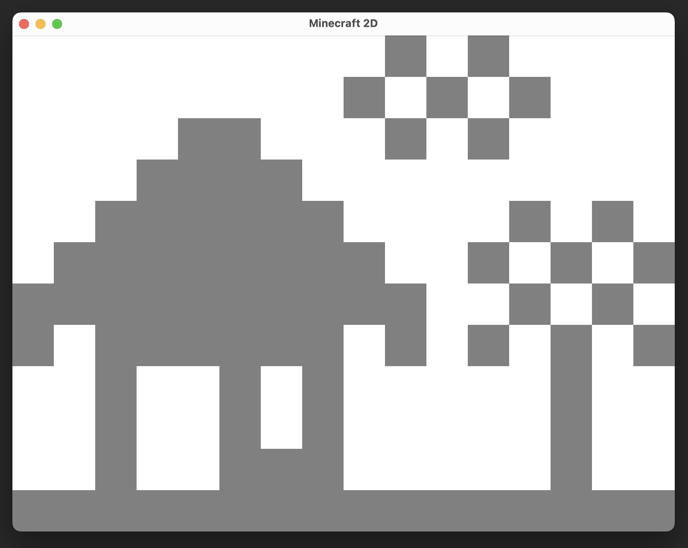

# Minecraft 2D Game User Manual

## Introduction

Welcome to the Minecraft 2D game! This game allows you to create a simple 2D world using only one block type. You can place and remove blocks to build your own structures and explore the virtual environment.



## Installation

To play the Minecraft 2D game, you need to follow these steps to set up the environment:

1. Install Java Development Kit (JDK) on your computer if you haven't already. You can download the latest version of JDK from the official Oracle website.

2. Download the game code files from the provided source.

3. Open a command prompt or terminal and navigate to the directory where you saved the game code files.

4. Compile the code by running the following command:

   ```
   javac *.java
   ```

5. Once the code is compiled successfully, you can run the game by executing the following command:

   ```
   java Main
   ```

6. The game window will appear, and you can start playing!

## Game Controls

The Minecraft 2D game is controlled using the mouse. Here are the controls:

- **Placing Blocks**: Click on an empty space in the game window to place a block of the selected type.

- **Removing Blocks**: Click on a block in the game window to remove it.

## Game Features

The Minecraft 2D game offers the following features:

- **Single Block Type**: The game uses only one type of block, which you can place and remove.

- **2D World**: The game environment is a 2D grid where you can build structures.

- **Real-time Updates**: The game updates in real-time as you place or remove blocks.

## Tips and Tricks

Here are some tips to enhance your Minecraft 2D game experience:

1. Experiment with different block placements to create unique structures.

2. Use the grid lines as a guide to align your blocks accurately.

3. Challenge yourself to build complex structures using only one block type.

4. Save your progress by taking screenshots of your creations.

5. Have fun and let your creativity flow!

## Troubleshooting

If you encounter any issues while running the Minecraft 2D game, try the following troubleshooting steps:

1. Make sure you have Java Development Kit (JDK) installed correctly.

2. Check if you have the latest version of Java installed.

3. Verify that you have compiled the code correctly using the `javac` command.

4. Ensure that you are running the game using the `java` command.

5. If the game window does not appear, check if there are any error messages in the command prompt or terminal.

If the issue persists, please reach out to our support team for further assistance.

## Conclusion

Congratulations! You have successfully installed and learned how to play the Minecraft 2D game. Enjoy building and exploring your virtual world using the simple block mechanics. Let your imagination run wild and create amazing structures!